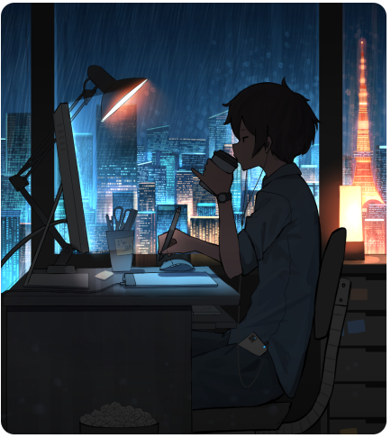

# Hello, Galaxy! 👋 I'm Kelvin Lehrback
<h3 align="center"> 
    Eterno estudante da computação!  Conheci a programação através do <a href="https://introcomp.ufes.br/" target="_blank">INTROCOMP</a>, projeto este no qual sou totalmente grato❤️!
</h3>

 

  <ul>
    <li>Técnico em Informática pelo Instituto Federal do Espírito Santo, <a href="https://serra.ifes.edu.br/" target="_blank">IFES-Serra</a>.
    </li>
    <li>
      Desenvolvedor de Jogos Eletrônicos(FIC) pelo Instituto Federal do Maranhão,  <a href="https://portal.ifma.edu.br/inicio/" target="_blank">IFMA</a>.
    </li>
    <li>
      Bacharel em Sistemas de Informação, também pelo <a href="https://serra.ifes.edu.br/" target="_blank">IFES-Serra</a>.
    </li>
    <li>
      Cursando Pós-Graduação em Inteligência Artificial e Ciência de Dados pela Universidade Federal do Espírito Santo, <a href="https://www.ufes.br/" target="_blank">UFES</a>.
    </li>
     <li>
      E Desenvolvedor de Software na <a href="https://www.seguroviagem.srv.br/" target="_blank">Real Seguro Viagem</a>.
    </li>
  </ul>

 
<!-- Stats and image -->

  

  

     
    
    
    
    
    
    
  

  

  

    <b>Contato profissional: </b>
     
    
  

