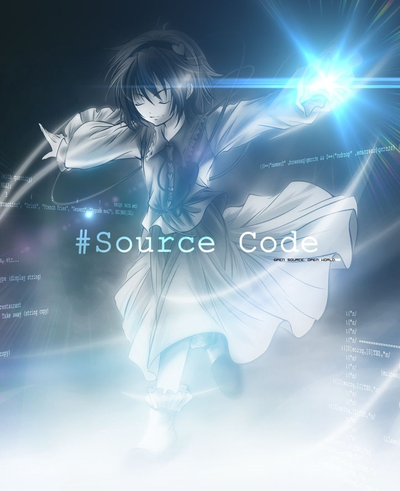

# Hello, Galaxy! 👋 I'm Kelvin Lehrback
<h3 align="center"> 
    Eterno estudante da computação!  Conheci a programação através do <a href="https://introcomp.ufes.br/">INTROCOMP</a>, projeto este no qual sou totalmente grato❤️!
</h3>
 
<!-- Stats and image -->

  

  

    
     
    
    
    
    
    
  

 

  

    Contato profissional: 
     
    
  

  
  

    Caso queira trocar uma ideia, jogar algo e ver memes  (e por que não, contato profissional?):
     
     
  

  

